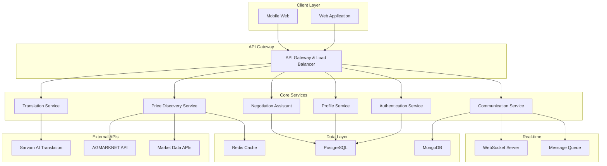

# Design Document: Multilingual MandiChallenge

## Overview

The Multilingual MandiChallenge is a web-based platform that serves as a real-time linguistic bridge for local trade in India. The system combines AI-powered multilingual translation, real-time price discovery, and intelligent negotiation assistance to create an inclusive trading environment for vendors across India's diverse linguistic landscape.

The platform addresses three core challenges in Indian local markets:
1. **Language barriers** that limit trading opportunities between vendors speaking different regional languages
2. **Information asymmetry** in pricing that disadvantages smaller vendors
3. **Inefficient negotiation processes** that lead to suboptimal deals

## Architecture

The system follows a microservices architecture with real-time communication capabilities:



## Components and Interfaces

### 1. Translation Service
**Purpose**: Provides real-time multilingual translation with commercial context preservation

**Key Components**:
- **Translation Engine**: Integrates with Sarvam AI's 22-language model for Indian languages
- **Context Processor**: Maintains commercial terminology and cultural nuances
- **Confidence Scorer**: Evaluates translation quality and flags low-confidence translations
- **Cache Manager**: Stores frequently used translations for performance

**Interface**:
```typescript
interface TranslationService {
  translateMessage(text: string, fromLang: string, toLang: string): Promise<TranslationResult>
  detectLanguage(text: string): Promise<LanguageDetection>
  getAvailableLanguages(): Promise<Language[]>
  validateTranslation(original: string, translated: string): Promise<ValidationResult>
}

interface TranslationResult {
  translatedText: string
  confidence: number
  alternativeTranslations?: string[]
  preservedTerms: string[]
}
```

### 2. Price Discovery Service
**Purpose**: Aggregates and analyzes market data to provide real-time pricing intelligence

**Key Components**:
- **Data Aggregator**: Collects data from AGMARKNET, commodity exchanges, and local markets
- **Price Analyzer**: Calculates fair prices, trends, and volatility indicators
- **Alert Manager**: Monitors price changes and sends notifications
- **Validation Engine**: Detects and filters anomalous price data

**Interface**:
```typescript
interface PriceDiscoveryService {
  getCurrentPrice(commodity: string, location?: string): Promise<PriceData>
  getPriceHistory(commodity: string, days: number): Promise<PriceHistory[]>
  getPriceTrends(commodity: string): Promise<TrendAnalysis>
  subscribeToAlerts(vendorId: string, commodities: string[]): Promise<void>
}

interface PriceData {
  commodity: string
  currentPrice: number
  priceRange: { min: number, max: number, modal: number }
  lastUpdated: Date
  sources: string[]
  volatility: number
}
```

### 3. Negotiation Assistant Service
**Purpose**: Provides AI-powered negotiation support and deal optimization

**Key Components**:
- **Strategy Engine**: Analyzes market conditions and suggests negotiation strategies
- **Cultural Adapter**: Adjusts recommendations based on regional trading customs
- **Deal Tracker**: Monitors negotiation progress and outcomes
- **Learning System**: Improves recommendations based on successful negotiations

**Interface**:
```typescript
interface NegotiationAssistant {
  suggestOpeningPrice(commodity: string, quantity: number, context: MarketContext): Promise<PriceSuggestion>
  analyzeCounterOffer(offer: NegotiationOffer, marketData: PriceData): Promise<OfferAnalysis>
  recommendResponse(negotiationHistory: NegotiationStep[]): Promise<ResponseRecommendation>
  evaluateDeal(finalPrice: number, marketPrice: number): Promise<DealEvaluation>
}

interface PriceSuggestion {
  suggestedPrice: number
  reasoning: string
  confidenceLevel: number
  marketJustification: string
}
```

### 4. Communication Service
**Purpose**: Manages real-time messaging and trade session coordination

**Key Components**:
- **Message Router**: Handles message delivery and translation coordination
- **Session Manager**: Manages trade sessions and participant states
- **Notification Engine**: Sends alerts and updates to vendors
- **History Manager**: Stores and retrieves conversation history

**Interface**:
```typescript
interface CommunicationService {
  sendMessage(sessionId: string, message: Message): Promise<void>
  createTradeSession(participants: string[], commodity: string): Promise<TradeSession>
  joinSession(sessionId: string, vendorId: string): Promise<void>
  getSessionHistory(sessionId: string): Promise<Message[]>
}

interface Message {
  id: string
  senderId: string
  content: string
  originalLanguage: string
  timestamp: Date
  messageType: 'text' | 'price_quote' | 'negotiation_offer'
}
```

### 5. Profile Service
**Purpose**: Manages vendor profiles, trust scores, and verification

**Key Components**:
- **Profile Manager**: Handles vendor registration and profile updates
- **Trust Calculator**: Computes and updates vendor reliability scores
- **Verification Engine**: Manages identity and business verification processes
- **Analytics Engine**: Generates vendor performance insights

**Interface**:
```typescript
interface ProfileService {
  createVendorProfile(profileData: VendorProfileData): Promise<VendorProfile>
  updateTrustScore(vendorId: string, transactionData: TransactionData): Promise<void>
  getVendorProfile(vendorId: string): Promise<VendorProfile>
  verifyVendor(vendorId: string, documents: VerificationDocument[]): Promise<VerificationResult>
}

interface VendorProfile {
  id: string
  name: string
  location: string
  preferredLanguage: string
  trustScore: number
  verificationStatus: 'pending' | 'verified' | 'rejected'
  tradingHistory: TradingSummary
}
```

## Data Models

### Core Entities

```typescript
// Vendor Entity
interface Vendor {
  id: string
  name: string
  email: string
  phone: string
  location: {
    state: string
    district: string
    market: string
    coordinates?: { lat: number, lng: number }
  }
  preferredLanguage: string
  secondaryLanguages: string[]
  businessType: 'farmer' | 'trader' | 'wholesaler' | 'retailer'
  verificationStatus: 'pending' | 'verified' | 'rejected'
  trustScore: number
  createdAt: Date
  lastActive: Date
}

// Trade Session Entity
interface TradeSession {
  id: string
  participants: string[] // vendor IDs
  commodity: string
  status: 'active' | 'completed' | 'cancelled'
  startTime: Date
  endTime?: Date
  finalDeal?: {
    price: number
    quantity: number
    buyerId: string
    sellerId: string
  }
  messages: Message[]
}

// Market Data Entity
interface MarketData {
  id: string
  commodity: string
  market: string
  date: Date
  prices: {
    minimum: number
    maximum: number
    modal: number
  }
  arrivals: number // quantity arrived in market
  source: string
  dataQuality: 'high' | 'medium' | 'low'
}

// Translation Cache Entity
interface TranslationCache {
  id: string
  sourceText: string
  sourceLang: string
  targetLang: string
  translatedText: string
  confidence: number
  context: 'general' | 'commercial' | 'negotiation'
  createdAt: Date
  usageCount: number
}
```

### Database Schema Design

**PostgreSQL Tables** (Structured data):
- `vendors` - Vendor profiles and authentication
- `trade_sessions` - Trading session metadata
- `negotiations` - Negotiation history and outcomes
- `trust_ratings` - Vendor ratings and feedback
- `market_integrations` - External API configurations

**MongoDB Collections** (Document-based):
- `messages` - Real-time messages with translations
- `market_data_raw` - Raw market data from various sources
- `analytics_events` - User interaction and system events

**Redis Cache**:
- `price_cache:{commodity}:{location}` - Current price data
- `translation_cache:{hash}` - Frequently used translations
- `session_state:{sessionId}` - Active session states
- `vendor_online:{vendorId}` - Online status tracking

## Correctness Properties

*A property is a characteristic or behavior that should hold true across all valid executions of a system—essentially, a formal statement about what the system should do. Properties serve as the bridge between human-readable specifications and machine-verifiable correctness guarantees.*

Based on the prework analysis and property reflection, the following properties ensure system correctness:

### Property 1: Translation Performance and Quality
*For any* message in any supported Indian language, when translated to another supported language, the system should complete translation within 2 seconds and preserve commercial terminology with confidence scores accurately reflecting translation quality.
**Validates: Requirements 1.1, 1.3, 1.5**

### Property 2: System Response Time Consistency  
*For any* user request (price lookup, commodity search, negotiation action), the system should respond within the specified time limits (2-3 seconds) regardless of system load or data complexity.
**Validates: Requirements 1.1, 2.1**

### Property 3: User Preference Persistence
*For any* vendor preference setting (language, notification preferences, display options), once set, the preference should persist across all future sessions and system interactions until explicitly changed.
**Validates: Requirements 1.4**

### Property 4: Required Information Completeness
*For any* system response (price displays, vendor profiles, trading reports, negotiation suggestions), all required information fields specified in the requirements should be present and populated with valid data.
**Validates: Requirements 2.3, 4.2, 4.3, 8.1, 8.2**

### Property 5: Data Update Consistency
*For any* scheduled data update process (market data refresh, price synchronization), updates should occur at the specified intervals during active hours and maintain data freshness within defined limits.
**Validates: Requirements 2.4**

### Property 6: Threshold-Based Action Triggering
*For any* system metric that reaches or exceeds defined thresholds (price volatility >=10%, translation confidence <85%, vendor ratings <3.0, price deviation >20%), the system should automatically trigger the appropriate response (alerts, warnings, flags, manual review).
**Validates: Requirements 1.5, 2.5, 3.5, 4.5**

### Property 7: Market-Based Recommendation Accuracy
*For any* negotiation assistance request, suggested prices and counter-offers should be within the specified variance of current market rates (±8% for counter-offers, ±20% for all price suggestions including cultural and learning adjustments) and based on real-time market data. Additionally, identical market conditions should produce price suggestions that vary by no more than 15% to ensure reasonable consistency while allowing for AI variability.
**Validates: Requirements 3.1, 3.2, 3.5, 3.7**

### Property 8: Cultural and Regional Adaptation
*For any* negotiation or recommendation involving vendors from different regions, the system should adapt suggestions and communication styles based on regional trading customs and cultural context.
**Validates: Requirements 3.3**

### Property 9: Learning System Improvement
*For any* completed negotiation or trade, the system should incorporate the outcome data to improve future recommendations. Measurable improvement is defined as: when analyzing 10 or more completed negotiations with similar market conditions, the system should demonstrate improved accuracy in price suggestions by at least 5% compared to baseline performance, and when sufficient learning data is available (minimum 20 negotiations), the system should show statistically significant improvement in at least one measurable metric (accuracy, success rate, or satisfaction) over a rolling 30-day period.
**Validates: Requirements 3.4**

### Property 10: Access Control and Verification
*For any* attempt to create vendor profiles or access restricted features, the system should enforce verification requirements and prevent unauthorized access until proper credentials are provided.
**Validates: Requirements 4.4**

### Property 11: Data Resilience and Fallback
*For any* external data source failure, the system should seamlessly fall back to cached data (not older than 4 hours) and continue providing service without user-visible errors.
**Validates: Requirements 5.3**

### Property 12: Data Quality and Anomaly Detection
*For any* incoming market data, the system should validate accuracy and automatically flag anomalies that exceed 25% variance from expected values, preventing corrupt data from affecting price recommendations.
**Validates: Requirements 5.4**

### Property 13: Responsive Design Consistency
*For any* screen size between 320px and 1920px width, the platform should render all essential features properly with touch targets meeting minimum size requirements (44px) on touch interfaces.
**Validates: Requirements 6.1, 6.4**

### Property 14: Mobile Feature Prioritization
*For any* mobile device access (screen width ≤ 768px), the system should always display essential features (navigation, search, price-display, message-input, user-menu) prominently and accessibly, while non-essential features may be hidden or collapsed to preserve screen space.
**Validates: Requirements 6.2**

### Property 15: Offline Functionality Preservation
*For any* network disconnection, the system should continue providing basic functionality (cached price viewing, saved conversation access) using locally stored data.
**Validates: Requirements 6.5**

### Property 16: Security Response Automation
*For any* detected suspicious activity or security threat, the system should automatically implement protective measures (account locking, user notification) within defined response times.
**Validates: Requirements 7.4**

### Property 17: Data Export and Deletion Completeness
*For any* vendor data export or deletion request, the system should process all associated data (trading history, messages, preferences) completely and provide confirmation of successful completion.
**Validates: Requirements 7.5, 8.3**

### Property 18: Insight Generation and Delivery
*For any* significant market change or trading pattern, the system should generate personalized insights for affected vendors and deliver them through appropriate channels within defined timeframes (15 minutes for high-priority insights, 2 hours for standard insights).
**Validates: Requirements 8.4, 8.5, 8.6, 8.7**

## Error Handling

The system implements comprehensive error handling across all components:

### Translation Service Error Handling
- **Low Confidence Translations**: When confidence drops below 85%, flag for manual review and provide alternative translations
- **Unsupported Language Pairs**: Gracefully degrade to English as intermediate language
- **API Failures**: Fall back to cached translations or simplified text processing
- **Timeout Handling**: Return partial translations with confidence warnings after 2-second timeout

### Price Discovery Error Handling  
- **External API Failures**: Use cached data with timestamps, notify users of data age
- **Data Validation Failures**: Flag anomalous data, use median values from multiple sources
- **Network Timeouts**: Return last known good data with staleness indicators
- **Missing Commodity Data**: Provide regional averages or similar commodity pricing

### Negotiation Assistant Error Handling
- **Insufficient Market Data**: Provide conservative recommendations with uncertainty indicators
- **Cultural Context Failures**: Fall back to general negotiation principles
- **Learning System Errors**: Use baseline algorithms while logging issues for improvement
- **Extreme Price Deviations**: Require manual confirmation for deals outside normal ranges

### Communication Service Error Handling
- **Message Delivery Failures**: Implement retry mechanisms with exponential backoff
- **Translation Errors**: Send original message with error notification
- **Session Management Failures**: Gracefully handle disconnections and reconnections
- **Real-time Sync Issues**: Implement conflict resolution for concurrent updates

### Data Layer Error Handling
- **Database Connection Failures**: Implement connection pooling and automatic failover
- **Data Corruption**: Use checksums and validation to detect and recover from corruption
- **Backup and Recovery**: Automated daily backups with point-in-time recovery capability
- **Cache Invalidation**: Smart cache warming and invalidation strategies

## Testing Strategy

The testing approach combines unit testing for specific scenarios with property-based testing for comprehensive coverage:

### Unit Testing Focus
- **Specific Examples**: Test concrete scenarios like "Hindi to Tamil translation of rice pricing"
- **Edge Cases**: Empty inputs, malformed data, network failures
- **Integration Points**: API connections, database operations, external service calls
- **Error Conditions**: Invalid authentication, missing data, timeout scenarios
- **Cultural Scenarios**: Region-specific negotiation patterns and language nuances

### Property-Based Testing Configuration
- **Testing Framework**: Use Hypothesis (Python) or fast-check (TypeScript) for property-based tests
- **Iteration Count**: Minimum 100 iterations per property test to ensure comprehensive coverage
- **Test Tagging**: Each property test tagged with format: **Feature: multilingual-mandi-challenge, Property {number}: {property_text}**
- **Data Generation**: Custom generators for Indian languages, commodity names, price ranges, and cultural contexts
- **Shrinking Strategy**: Implement custom shrinking for complex data types like negotiation histories

### Dual Testing Benefits
- **Unit Tests**: Catch specific bugs, validate integration points, test error conditions
- **Property Tests**: Verify universal correctness, handle edge cases automatically, ensure system robustness
- **Combined Coverage**: Unit tests provide concrete examples while property tests verify general behavior across all inputs

### Testing Data Requirements
- **Language Datasets**: Sample text in all 22 supported Indian languages
- **Market Data**: Historical price data for major commodities across different regions
- **Cultural Patterns**: Regional negotiation styles and trading customs
- **Performance Baselines**: Response time expectations under various load conditions

The testing strategy ensures that both specific use cases and general system properties are thoroughly validated, providing confidence in the system's correctness and reliability across India's diverse trading environments.